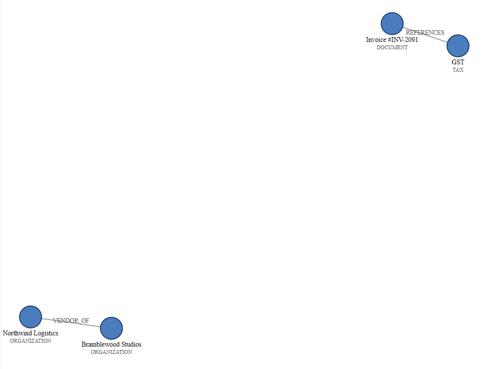

# Entity Graph Report

An end-to-end SuperDocs build that turns a set of related documents into an evidence-grounded structured report using entity-relationship graph retrieval.

The build combines document evidence, an entity graph, a generated relationship diagram, and SuperDocs' document editing workflow. The resulting report sections are grounded in approved evidence from the source document set.

> This standalone package contains the SuperDocs integration layer and reproducible fixtures. The underlying entity-graph extraction and report-generation pipeline was developed separately in the DocTask implementation.

## What it demonstrates

This build uses the core SuperDocs document workflow:

1. Upload a document/outline.
2. Send chat/edit instructions for report sections.
3. Approve the proposed changes.
4. Export the finished document.

It also uses the SuperDocs image-upload surface to attach the generated relationship diagram.

### SuperDocs features used

- Document upload
- Async chat/edit instructions
- Proposed-change approval
- Document export
- Image upload
- Multi-section document workflow

## Project structure

```text
entity-graph-report/
├── README.md
├── requirements.txt
├── superdocs_client.py
├── report_to_superdocs.py
├── demo.py
├── fixtures/
│   ├── approved_sections.json
│   └── diagram.svg
└── evidence/
    └── exported-report.docx
```

## Requirements

- Python 3.10+
- A SuperDocs API key

### Install the dependency

```bash
pip install -r requirements.txt
```

### Set the API key

**PowerShell:**

```powershell
$env:SUPERDOCS_API_KEY="your-key-here"
```

**Bash:**

```bash
export SUPERDOCS_API_KEY="your-key-here"
```

The default SuperDocs API base URL is already configured by the client.

It can optionally be overridden with:

```text
SUPERDOCS_BASE_URL
```

## Run

From the `entity-graph-report` directory:

```bash
python demo.py
```

The demo creates a fresh SuperDocs session for each run and performs the complete upload → edit → approve → export workflow using the included fixtures.

The exported DOCX is written as:

```text
entity-graph-report-export.docx
```

## Evidence and fixtures

The `fixtures/` directory contains:

- `approved_sections.json` — two evidence-grounded report sections and their source citations.
- `diagram.svg` — the relationship diagram generated from the report's entity/relationship graph.

The `evidence/exported-report.docx` file is an actual export produced by this standalone package's live SuperDocs round trip.

## DOCX image-export limitation

During live testing, SuperDocs successfully accepted and stored the uploaded relationship diagram, but its DOCX exporter dropped the embedded image.

The exported DOCX retains the **Relationship Diagram** heading but contains no image media.

The same untouched SuperDocs session exported as HTML preserves the uploaded image.

This was independently reproduced during testing and is documented as a SuperDocs-side DOCX conversion limitation rather than an issue with this integration.

The original relationship diagram is included as:

```text
fixtures/diagram.svg
```

## Relationship to DocTask

The entity-graph extraction and evidence-grounded report pipeline was developed as part of a separate DocTask implementation.

This public package intentionally contains only the SuperDocs-facing integration and static fixtures required to reproduce the assigned build.

It does not require the DocTask backend, PostgreSQL, LangGraph, Groq, ChromaDB, or any other DocTask service.

## Screenshot



## Assignment

Built by **Srikanth** for the **SuperDocs Task 2 engineering assignment**.
